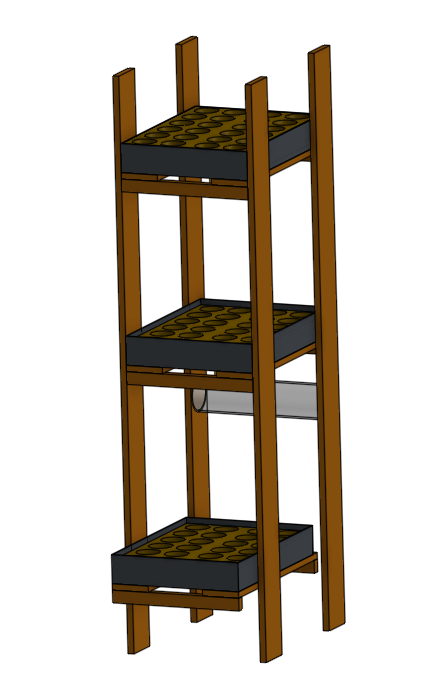

# StadtFarm
How to build and program a vertical garden for growing hydro cultures with Arduino UNO. This project uses sensors, has redundant operations and a fail safe mode. It is build to automatic water a bigger shelf, turn on artificial sunlight and control moisture of the plants. This project aims to build a bigger community to solve future challenges concerning autonomous and independend food production and supply in cities.

## Introduction

## 1.0 Features
* Time module included
* Automated watering
* Light intensity sensor
* Using artificial sunlight
* Moisture measuremnt
* Growing up to 72 plants in parallel
* Control of water level in storage tank
* Alarms (water level, moisture)

## 2.0 Requirements

### 2.1 Supported Boards
Arduino Uno or Elegoo UNO R3

### 2.2 Devices and Sensors 
* [Arduino Uno, original recommended (20,-€)](https://store.arduino.cc/arduino-uno-rev3)
* [RTC DS3231 (5,50€)](https://www.az-delivery.de/en/products/ds3231-real-time-clock)
* [4 x Relais Module (5,80€)](https://www.az-delivery.de/en/products/4-relais-modul)
* [Switch module (7,60€)](https://www.amazon.de/ANGEEK-Switching-Modul-Treiber-Arduino-Raspberry/dp/B07JYHV475)
* [220V/AC to 12V/DC (5,-€)](https://www.sealochh.com/index.php?main_page=product_info&products_id=208907)
* [12V Pump (9,-€)](https://www.amazon.de/gp/product/B0721JLQG9/ref=ppx_yo_dt_b_search_asin_title?ie=UTF8&psc=1)
* [3 x LED grow light (ex. 300W, 65,-€)](https://www.amazon.de/gp/product/B07Z678V5H/ref=ppx_yo_dt_b_search_asin_title?ie=UTF8&psc=1)
* [Voltage Converter (5,50€)](https://www.az-delivery.de/en/products/spannungswandler-5a-8-36v-zu-1-25-32v)
* [Capacitiy Sensor for moisture measurment (5,-€)](https://www.az-delivery.de/en/products/bodenfeuchte-sensor-modul-v1-2)
* [Wire set (10,-€)](https://www.az-delivery.de/en/products/3x-breadboard-3x-jumper-wire?_pos=9&_sid=47a581137&_ss=r)
* opt. Small Breadboard (ca. 2,-€)
* [opt. Touchless Tank Liquid Water Level Detect Sensor (5,80€)](https://www.amazon.de/-/en/SODIAL-12-24V-Touchless-Liquid-Container/dp/B0725S85QK)
* opt. RGB LED

### 2.2 Required libraries
* [CountDown](https://github.com/RobTillaart/CountDow)
* [BH1750FVI_RT for BH1750FVI (GY-30) 16 bit I2C Lux sensor](https://github.com/RobTillaart/BH1750FVI_RT)
* [RTClib](https://github.com/adafruit/RTClib)
* TinyWire, vers. 1.1.0

### 2.3 Additional requirements for plant growing
* [Nutrient solution (ex Aqua36, 9,-€)](https://www.amazon.de/dp/B07Y9ZBZT5?tag=hydrokleingarten-21&linkCode=ogi&th=1&psc=1)
* [3 x tub (10,-€)](https://www.amazon.de/GREEN24-Gew%C3%A4chshaus-Wanne-wasserdicht-Pflanzen-Gew%C3%A4chsh%C3%A4user/dp/B011KFQ9EO/ref=sr_1_11?__mk_de_DE=%C3%85M%C3%85%C5%BD%C3%95%C3%91&dchild=1&keywords=wanne&qid=1616073432&sr=8-11)
* puffed cley (in most home improvement stores/Baumarkt)
* PVC pipe, ca 4m, inner diameter 8mm (in most home improvement stores/Baumarkt)
* [6 x Hose nozzle with external thread - brass, G1/4 (ex. 1,10€)](https://www.esska.de/shop/Schlauchtuelle-mit-Aussengewinde-Messing--27070x-10150?hlid=270745)
* [Water storage tank, min 20L](https://www.google.com/search?bih=941&biw=1920&hl=en&tbm=shop&ei=3W1TYN6HBY7msAfm053YDQ&q=keeeper+Box+black+30+liter&oq=keeeper+Box+black+30+liter&gs_lcp=Cgtwcm9kdWN0cy1jYxADUIlCWKVIYK1JaABwAHgAgAF4iAGcBZIBAzUuMpgBAKABAcABAQ&sclient=products-cc&ved=0ahUKEwie6oq5kLrvAhUOM-wKHeZpB9sQ4dUDCAo&uact=5)
* [6 x Lock nut - brass - hexagon - inch thread G1/4 (ex. 0,50€)](https://www.esska.de/shop/Gegenmutter-Messing-sechskant-Zoll-Gewinde--858970000000-5010?hlid=858970000002)
* [12 x rofile sealing rings - made of NBR or Viton G1/4 (ex. each 0,50€)](https://www.esska.de/shop/Profildichtringe-aus-NBR-oder-Viton-zoellig-fuer-Schneidring-Verschraubunge--drXednbrdrXe-11120?hlid=DR14EDNBR000)
* small tubes (diameter 8mm) to controll water level and runoff time in tubs
* copper pipe for upper lightning (has to be bend, alt. hang from ceiling)

### 2.4 Build shelf with 3 plains (optional)
As this is a DIY project you can build a nice, wooden shelf yourself - [Build shelf](https://cad.onshape.com/documents/f8f54480ea3bf53fba16157c/w/51a61f7f288ccbb844862388/e/fdeeb675309a4b794120bc05). Here you find a basic sketch with all secifications for a 1.8m shelf.

## 3.0 Getting Started
1. Connect Arduino with sensors, see electrical plan "E-Plan, StadtFarm-Arduino-Uno" ([QElectroTech](qelectrotech.org/))
2. Assemble all, so it looks nice (more pictures and movie will follow)
3. Upload Code using [Arduino IDE](https://www.arduino.cc/en/Main/Software) (be aware that Ardunino starts immediately and actuators (pump) cound be demaged)

## 4.0 Instructions

### 4.1 Plants for hydro culture
Make your own research and contribute to projects
* [Database for contributors](https://www.notion.so/Recommended-plants-for-hdrophonic-system-34db4e27f24a4bb899e11b0e7d632004)
* https://dengarden.com/gardening/indoor-hydroponic-garden

### 4.2 Maintenance
* Add nutrient solution if conductivity is below 1.6yS (conductivity sensor will follow)
* clean whole system and mix new solution every 4 weeks (reduce algae growth)

## 5.0 Troubleshooting

## 6.0 Future development
* air humidity sensor
* store information in EEPROM
* LCD display
* Wifi connector and App data management
* Temperature sensor
* optical device for Chlorophyll sensing and develop an AI

## Contributors
* Light sensor code, written by Mohannad Rawashdeh
